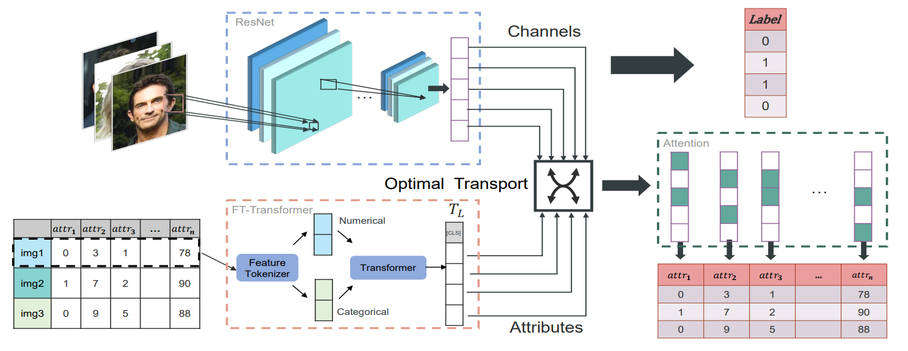

# Tabular Insights, Visual Impacts: Transferring Expertise from Tables to Images

Please cite our ICML'24 paper, [Tabular Insights, Visual Impacts: Transferring Expertise from Tables to Images](https://openreview.net/pdf?id=v7I5FtL2pV), if this code was helpful.

```
@inproceedings{jiang2024tabular,
  title={Tabular insights, visual impacts: transferring expertise from tables to images},
  author={Jiang, Jun-Peng and Ye, Han-Jia and Wang, Leye and Yang, Yang and Jiang, Yuan and Zhan, De-Chuan},
  booktitle={Forty-first International Conference on Machine Learning},
  year={2024}
}
```

## CHARMS

We propose CHannel tAbulaR alignment with optiMal tranSport(CHARMS), which establishes an alignment between image channels and tabular attributes, enabling selective knowledge transfer that is pertinent to visual features. By maximizing the mutual information between image channels and tabular features, knowledge from both numerical and categorical tabular attributes are extracted. Experimental results demonstrate that CHARMS not only enhances the performance of image classifiers but also improves their interpretability by effectively utilizing tabular knowledge.



## Instructions

Install environment using `conda env create --file environment.yaml`. 

To run, execute `python run.py`.

Since we need to calculate representation for each tabular attribute, you should change the source code of rtdl.FTTransformer in Line 1164.

```python
x_out = self.head(x)
return x[:, :-1, :], x_out
```

and in Line 1485,

```python
def forward(self, x_num: Optional[Tensor], x_cat: Optional[Tensor]) -> Tensor:
    x = self.feature_tokenizer(x_num, x_cat)
    x = self.cls_token(x)
    x_embed, x_out = self.transformer(x)
    return x_embed, x_out
```


### Arguments - Command Line

We integrate our code into the MMCL framework. To execute MMCL code, please refer to [this](https://github.com/paulhager/MMCL-Tabular-Imaging/tree/main).


To run our code, for example in petfinder_adoption dataset, please run:

`python run.py pretrain=True test=True datatype=charms dataset=adoption`


Your data should be constructed in `/configs/dataset`, please refer to `adoption.yaml`.


### Data

The DVM cars dataset is open-access and can be found [here](https://deepvisualmarketing.github.io/).

The CelebA dataset is open-access and can be found [here](https://mmlab.ie.cuhk.edu.hk/projects/CelebA.html).

The SUN dataset is open-access and can be found [here](https://groups.csail.mit.edu/vision/SUN/hierarchy.html).

The Adoption dataset is open-access and can be found [here](https://www.kaggle.com/competitions/petfinder-adoption-prediction).

The Pawpularity dataset is open-access and can be found [here](https://www.kaggle.com/competitions/petfinder-pawpularity-score).

The Avito dataset is open-access and can be found [here](https://www.kaggle.com/competitions/avito-demand-prediction).


## Acknowledgment

We thank the following repos providing helpful components/functions in our work.

- [MMCL](https://github.com/paulhager/MMCL-Tabular-Imaging/tree/main)
- [RTDL](https://github.com/yandex-research/rtdl)
- [MINE](https://github.com/gtegner/mine-pytorch)
- [POT](https://pythonot.github.io/)
